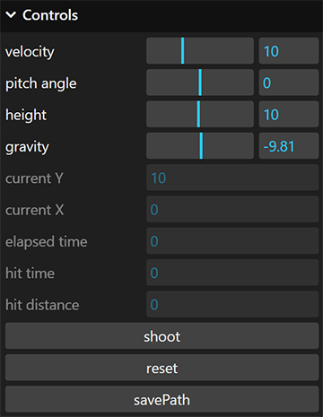

# Projectile Motion

## Introduction
 

**Projectile motion** is the motion of an object thrown or projected into the air, subject to only the acceleration of gravity. The object is called a **projectile**, and its path is called its **trajectory**[[1]](#physics_ref). This playground demonstrates the 3d motion of the balls shot out from the source located above the ground surface. Projectile dynamics take into account the pitch angle and the height of the source as well as the projectile velocity. After the user sets the parameters, the simulation generates a curved path, a combination of parabolas and straight lines, under the action of specified gravity. The introduced demo is a good start in studying ballistics and more complex problems such as the behaviour of the bullets, unguided bombs and rockets.

## User Interface

In the **Control Panel**, the user can adjust several simulation parameters: 
1. Initial velocity of the projectile to be launched.
2. Pitch angle of the launching source. 
3. Height of the launching source.
4. Gravity that acts on the projectile.

The viewport consists of a surface, launching source and a wall that serves as a space boundary for projectiles. After setting up the control inputs, click a "shoot" button to start the action. The coloured lines trace the projectile motion showing its complete trajectory, which can be locally saved through the "savePath" option. The Control panel also provides details about the flying projectile. You can follow a real-time change of the ball's positional coordinates, the time and distance from the source when it first hits the surface, as well as the total elapsed time. If multiple projectiles have been launched, the drawn trajectory and flying data refer to the last.
 

## References

<a name="physics_ref">[1]</a> Urone, P. P., & Hinrichs, R. (2020). Physics. OpenStax. <https://openstax.org/books/physics/pages/1-introduction>

