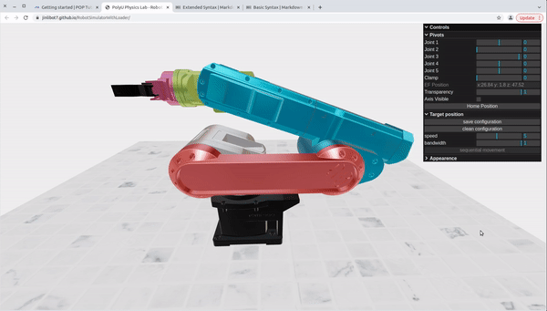
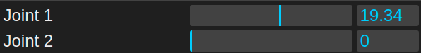
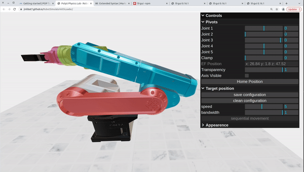
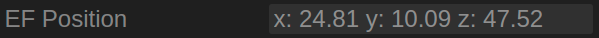
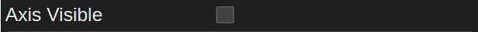
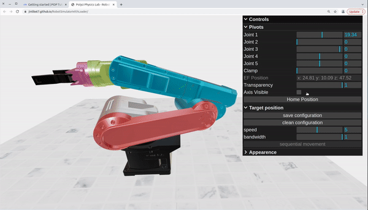
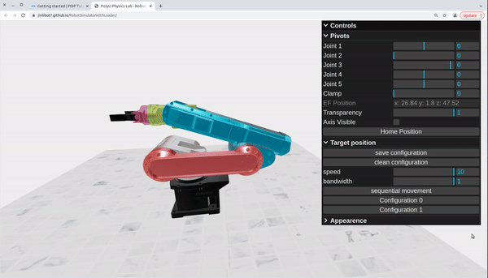

## Overview
 
POP is an online educational platform developed by the [ROMI Lab](https://www.romi-lab.org/) at The Hong Kong Polytechnic University ([PolyU](https://www.polyu.edu.hk/)). Currently, POP consists of four simulations of canonical dynamic systems in robotics and control, with a strong emphasis on interactive learning. POP is inspired by many open-source robotics simulation platforms such as [Drake](https://drake.mit.edu/) and [Webots](https://cyberbotics.com/). As it is designed specifically for online undergraduate education, we strive to make POP **ready-to-use**, **interactive** and **informative**. 

**Ready-to-use** refers to students being able to access the simulations without any package installation or environment configuration, which is a nightmare for probably all beginners. To this end, POP is purely web-based and accessible on different platforms including PCs, mobiles and tablets. As for POP's content design, we believe through **controllable interactions** with dynamic systems in a simulation environment, the essence of the robotics and control theories can be effectively and intuitively grasped by students. To make it possible, the system dynamics of the POP simulations are programmed precisely accroding to the governing physical equations. Critical terms in these linear and non-linear equations such as controller parameters, robot joint configurations, and spring stiffness can be altered by students through an interative user interface. As for the last attribute **informative**, it refers to this tutorial per se. POP tutorials not only provide instructions on how use the developed simulations, but also present a consise introduction to the background knowledge of each topic. For students who want to go deeper, supplementary materials are also included at the end of the tutorial.

POP is still at a preliminary stage. The source code is mainly written in JavaScript and is available on corresponding Github [repos](https://github.com/JinliBot7?tab=repositories). Open-source contributions are highly welcomed! The web-based 3D simulations in POP are based on [Threejs](https://threejs.org/). If you are a complete newbie, don't worry, check out this step-by-step [tutorial](https://threejs-journey.com/).

---
## View point control
 
In this section, we introduce how to navigate in POP. You can use the [robot](https://jinlibot7.github.io/RobotSimulatorWithLoader/) simulator as an example.

- **Rotate**: Press and hold Left Mouse Button (**LMB**) + Drag.
- **Translate**: Press and hold **Ctrl** + Press and hold **LMB** + Drag.
- **Zoom in/out**: Roll the mouse wheel.
- **Reset**: Press **F5**.

---
## User interface
 
In this section, we introduce how to use the User Interface (UI) to interact with the simulation. You can use "**Ctrl**" and "**+**" to increase the font size and vice versa.

- **Number controller** consists of a sliding bar and a text input field. It allows the user to change a parameter of the dynamic system or control input.

- **Text container** shows the **varying** system states and the magnitude of control input. Usually, it is not editable.

- **Event box** switches between two system status.

- **Button** triggers a specific event.

- **UI folders** are sometimes folded.

The POP UI is developed based on [lil-gui](https://github.com/georgealways/lil-gui).

